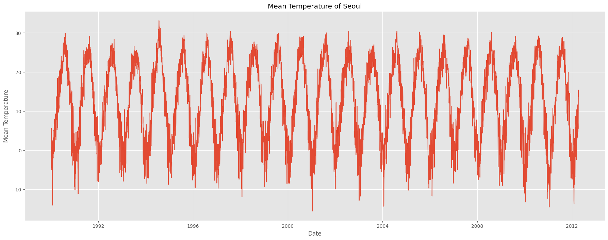
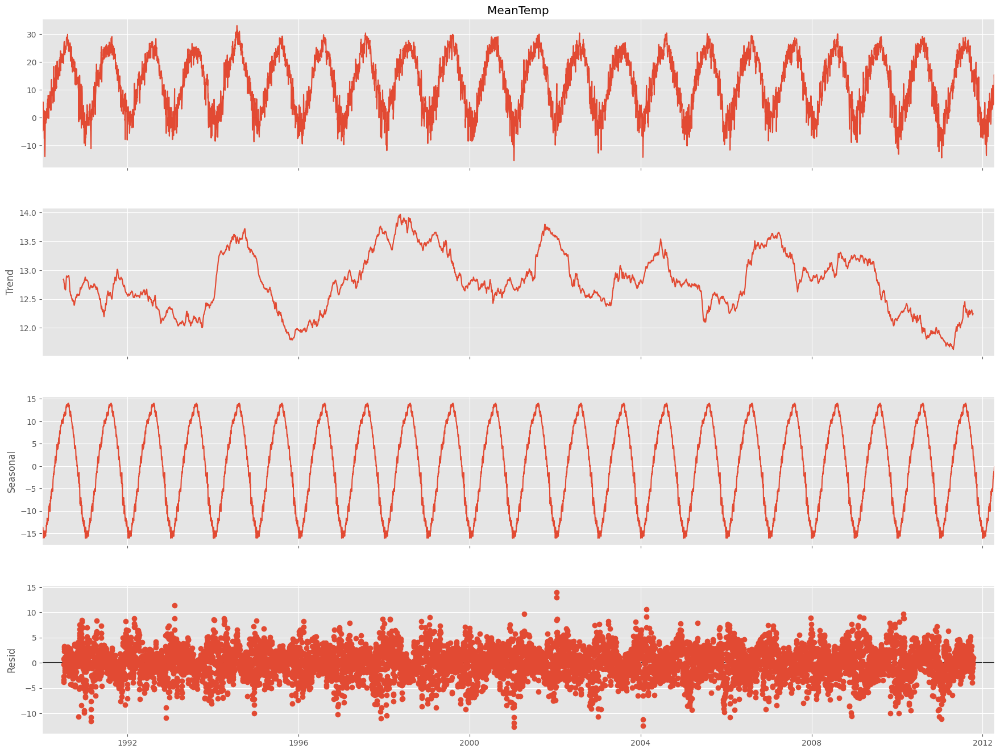
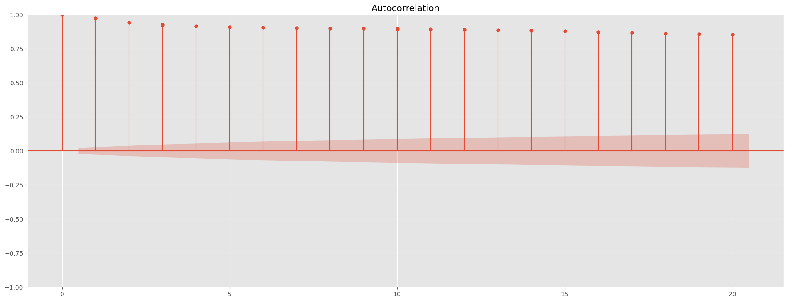
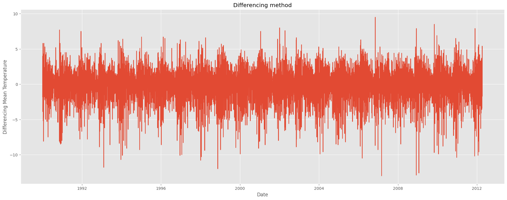
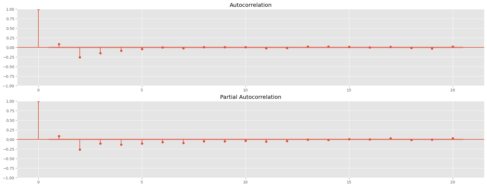
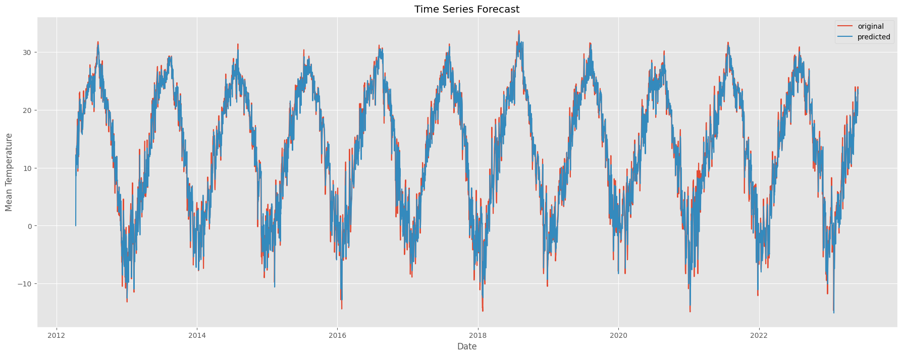

# Import Module


```python
import warnings
import numpy as np
import pandas as pd
import statsmodels.api as sm
import matplotlib.pyplot as plt
from statsmodels.tsa.arima.model import ARIMA
from datetime import datetime
from statsmodels.tsa.seasonal import seasonal_decompose

warnings.filterwarnings("ignore")

plt.style.use('ggplot')

weather = pd.read_csv("Seoul_Date_temperature_data(1990_2023).csv")
weather_Seoul= weather.loc[:,["Date","MeanTemp"]]

weather_Seoul["Date"] = pd.to_datetime(weather_Seoul["Date"])


weather_Seoul
```


<div>

<table border="1" class="dataframe">
  <thead>
    <tr style="text-align: right;">
      <th></th>
      <th>Date</th>
      <th>MeanTemp</th>
    </tr>
  </thead>
  <tbody>
    <tr>
      <th>0</th>
      <td>1990-01-01</td>
      <td>-1.7</td>
    </tr>
    <tr>
      <th>1</th>
      <td>1990-01-02</td>
      <td>-3.5</td>
    </tr>
    <tr>
      <th>2</th>
      <td>1990-01-03</td>
      <td>-5.0</td>
    </tr>
    <tr>
      <th>3</th>
      <td>1990-01-04</td>
      <td>-3.3</td>
    </tr>
    <tr>
      <th>4</th>
      <td>1990-01-05</td>
      <td>0.7</td>
    </tr>
    <tr>
      <th>...</th>
      <td>...</td>
      <td>...</td>
    </tr>
    <tr>
      <th>12199</th>
      <td>2023-05-27</td>
      <td>19.3</td>
    </tr>
    <tr>
      <th>12200</th>
      <td>2023-05-28</td>
      <td>19.2</td>
    </tr>
    <tr>
      <th>12201</th>
      <td>2023-05-29</td>
      <td>23.2</td>
    </tr>
    <tr>
      <th>12202</th>
      <td>2023-05-30</td>
      <td>24.0</td>
    </tr>
    <tr>
      <th>12203</th>
      <td>2023-05-31</td>
      <td>22.8</td>
    </tr>
  </tbody>
</table>
<p>12204 rows × 2 columns</p>
</div>


# Plot Data


```python
plt.figure(figsize=(22,8))
plt.plot(weather_Seoul.Date[:8136],weather_Seoul.MeanTemp[:8136])
plt.title("Mean Temperature of Seoul")
plt.xlabel("Date")
plt.ylabel("Mean Temperature")
plt.show()
```


​    

​    


# Plot Seasonal decompose


```python
timeSeries = weather_Seoul.loc[:,["Date","MeanTemp"]]
timeSeries.index = timeSeries.Date
ts = timeSeries.drop("Date",axis = 1)[:8136]


result = seasonal_decompose(ts['MeanTemp'], model='additive', period=365)

fig = plt.figure()
fig = result.plot()
fig.set_size_inches(20,15)
```


    <Figure size 640x480 with 0 Axes>


​    

​    


# Plot ACF


```python
fig = plt.figure(figsize=(22,8))
ax1 = fig.add_subplot(111)
fig = sm.graphics.tsa.plot_acf(ts , lags = 20, ax = ax1)
```


​    

​    


# Difference


```python
ts_diff = ts - ts.shift()
plt.figure(figsize=(22,8))
plt.plot(ts_diff[1:])
plt.title('Differencing method')
plt.xlabel("Date")
plt.ylabel("Differencing Mean Temperature")
plt.show()
```


​    

​    


# Plot ACF , PACF


```python
fig = plt.figure(figsize = (22,8))

ax1 = fig.add_subplot(211)
fig = sm.graphics.tsa.plot_acf(ts_diff[1:],lags=20,ax = ax1)

ax2 = fig.add_subplot(212)
fig = sm.graphics.tsa.plot_pacf(ts_diff[1:],lags=20,ax = ax2)
```


​    

​    


# Prediction


```python
ts_predict = timeSeries.drop("Date",axis = 1)[8136:]
model = ARIMA(ts_predict,order = (2,1,2))
model_fit = model.fit()

start_index = datetime(2012,4,11)
end_index = datetime(2023,5,31)
forecast = model_fit.predict(start = start_index,end = end_index,typ = 'levels')

plt.figure(figsize=(22,8))
plt.plot(weather_Seoul.Date[8136:],weather_Seoul.MeanTemp[8136:],label = "original")
plt.plot(forecast,label = "predicted")
plt.title("Time Series Forecast")
plt.xlabel("Date")
plt.ylabel("Mean Temperature")
plt.legend()
plt.show()
```


​    

​    

# Scoring

```python
from sklearn import metrics

def scoring(y_true, y_pred):
    r2 = round(metrics.r2_score(y_true, y_pred) * 100, 3)
    corr = round(np.corrcoef(y_true, y_pred)[0, 1], 3)
    mape = round(
        metrics.mean_absolute_percentage_error(y_true, y_pred) * 100, 3)
    rmse = round(metrics.mean_squared_error(y_true, y_pred, squared=False), 3)

    df = pd.DataFrame({
        'R2': r2,
        "Corr": corr,
        "RMSE": rmse,
        "MAPE": mape
    },index=[0])
    return df
###################################################
scoring(np.array(weather_Seoul[weather_Seoul.Date>=start_index].MeanTemp),np.array(forecast))
```


<div>

<table border="1" class="dataframe">
  <thead>
    <tr style="text-align: right;">
      <th></th>
      <th>R2</th>
      <th>Corr</th>
      <th>RMSE</th>
      <th>MAPE</th>
    </tr>
  </thead>
  <tbody>
    <tr>
      <th>0</th>
      <td>95.55</td>
      <td>0.978</td>
      <td>2.24</td>
      <td>2.201661e+15</td>
    </tr>
  </tbody>
</table>
</div>


```python

```
