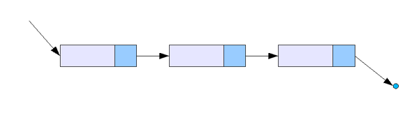
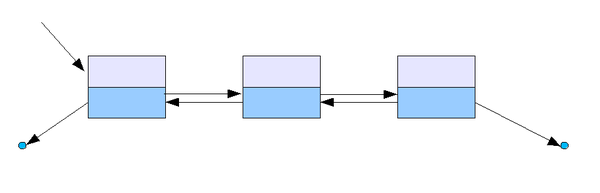
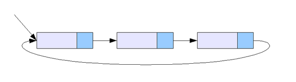
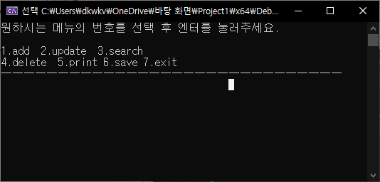
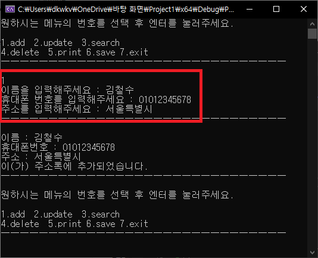
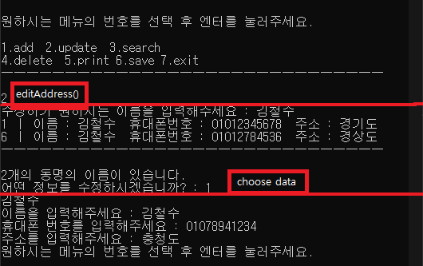
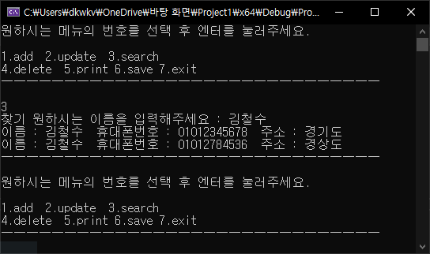
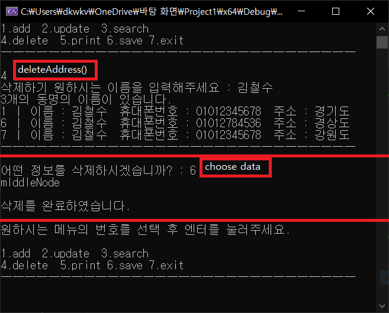
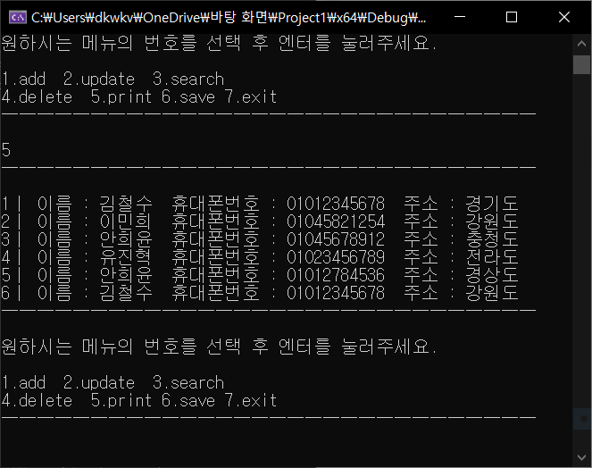
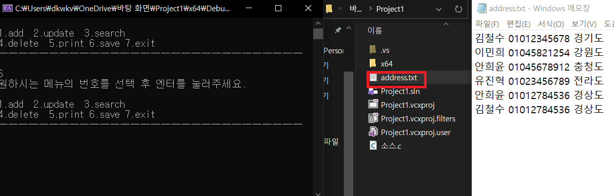

##### (본 페이지는 C언어 x86기준으로 작성하였습니다.)

# 이중연결 리스트를 이용한 주소록<br/>(Address With Doublelinked List)

### 연결 리스트란?

각 노드가 데이터와 포인터를 가지고 한 줄로 연결되어 있는 방식으로 데이터를 저장하는 자료 구조이다. 

이름에서 말하듯이 데이터를 담고 있는 노드들이 연결되어 있는데, 노드의 포인터가 다음이나 이전의 노드와의 연결을 담당하게 된다.

연결 리스트의 종류로는 단일 연결 리스트, 이중 연결 리스트 등이 있다.



​											그림1 Single Linked List




​											그림2 Double Linked List



​											그림3 Circular Linked List


# 프로그램 개요

- 구조체

  - 주소록 데이터로 쓸 이름,휴대폰 번호,주소와 

    다음 노드를 가리킬 포인터 next와 이전 노드를 가리킬 포인터 prev를 추가한다.

- main()

  - 수행할 기능을 키보드(숫자)로 입력받아 아래의 기능을 수행한다.
  - 추가, 수정, 검색, 삭제, 출력, 파일 저장, 종료



- 추가(addAddress)
  - 새로운 노드를 생성해 데이터들을 입력받아 맨 끝 노드 뒤에 연결한다.



- 수정(editAddress)

  - 수정하고자 하는 데이터의 이름을 입력받아 수정합니다.

    만약 중복 데이터가 있다면 모두 출력 후, 그 중에 하나를 골라 수정합니다.



- 검색(searchAddress)
  - 검색하고자 하는 이름을 입력받아 일치하는 데이터 모두 출력합니다.



- 삭제(deleteAddress)

  - 삭제하고자 하는 데이터의 이름을 입력받아 해당 노드를 삭제한다.

    만약 중복 데이터가 있다면 모두 출력 후, 그 중에 하나를 골라 수정한다.




- 출력(printAddress)
  - 주소록 전체를 출력한다.




- 파일저장(saveFile)
  - 주소록 전체를 txt 파일로 저장한다.




# Code

```c
#define _CRT_SECURE_NO_WARNINGS
#include<stdio.h>
#include<stdlib.h>
#include<string.h>

typedef struct Address {
    char name[12];
    char phoneNumber[12];
    char address[30];
    struct Address* next;
    struct Address* prev;
} Address;

void printLine() {
    printf("ㅡㅡㅡㅡㅡㅡㅡㅡㅡㅡㅡㅡㅡㅡㅡㅡㅡㅡㅡㅡㅡㅡㅡㅡㅡㅡㅡㅡㅡㅡ\n\n");
}

void addAddress(Address** myAddress, Address** tail) {

    Address* newAddress = (Address*)malloc(sizeof(Address));

    printf("이름을 입력해주세요 : ");
    scanf("%s", newAddress->name);

    printf("휴대폰 번호를 입력해주세요 : ");
    scanf("%s", newAddress->phoneNumber);

    printf("주소를 입력해주세요 : ");
    scanf("%s", newAddress->address);
    if (*myAddress == NULL) {// empty node

        newAddress->next = NULL;
        newAddress->prev = NULL;
        *myAddress = newAddress;
        *tail = newAddress;
    }
    else {//one or more nodes
        newAddress->prev = *tail;
        newAddress->next = NULL;

        (*tail)->next = newAddress;
        newAddress->prev = *tail;
        *tail = newAddress;
    }
    printLine();//horizontal line output for readability
    printf("이름 : %s\n휴대폰번호 : %s\n주소 : %s\n이(가) 주소록에 추가되었습니다.\n", newAddress->name, newAddress->phoneNumber, newAddress->address);
    printLine();
}

void editAddress(Address** myAddress, Address** tail) {
    int i = 0;
    char searchName[10] = "";
    Address* p = *myAddress;//p is the current node and initialize to address pointer

    if (p == NULL) {//empty node
        printf("주소록이 비어있습니다.\n");
    }
    else {

		//selNum counts how many matching data nodes have
        //selNum2 number of nodes you want to edit
        int selNum = 0, selNum2 = 0;

        printf("수정하기 원하시는 이름을 입력해주세요 : ");
        scanf("%s", searchName);

        for (i = 0; p != NULL; i++) {//counts how many matching data nodes have
            if (!strcmp(searchName, p->name)) {
                selNum++;
            }
            p = p->next;
        }

        p = *myAddress;//initialize to address pointer

        if (selNum == 0) {
            printf("입력하신 정보가 없습니다.\n\n");
        }
        else if (selNum == 1) {//when the number of matching nodes is one
            for (i = 0; p != NULL; i++) {
                if (!strcmp(searchName, p->name)) {
                    break;
                }
                p = p->next;
            }
            printf("이름을 입력해주세요 : ");
            scanf("%s", p->name);

            printf("휴대폰 번호를 입력해주세요 : ");
            scanf("%s", p->phoneNumber);

            printf("주소를 입력해주세요 : ");
            scanf("%s", p->address);

        }
        else {// more than two
            for (i = 0; p != NULL; i++) {
                if (!strcmp(searchName, p->name)) {
                    printf("%d ㅣ 이름 : %s  휴대폰번호 : %s  주소 : %s\n", i + 1, p->name, p->phoneNumber, p->address);
                }
                p = p->next;
            }

            printLine();
            printf("%d개의 동명의 이름이 있습니다.\n", selNum);
            printf("어떤 정보를 수정하시겠습니까? : ");
            scanf("%d", &selNum2);

            p = *myAddress;

            for (i = 0; i < selNum2 - 1; i++) {
                p = p->next;
            }
            printf("%s\n", p->name);
            printf("이름을 입력해주세요 : ");
            scanf("%s", p->name);

            printf("휴대폰 번호를 입력해주세요 : ");
            scanf("%s", p->phoneNumber);

            printf("주소를 입력해주세요 : ");
            scanf("%s", p->address);
        }
    }
}

void searchAddress(Address** myAddress, Address** tail) {

    int i = 0, j = 0;
    char searchName[10] = "";
    Address* p = *myAddress;

    if (p == NULL) {
        printf("주소록이 비어있습니다.\n");
    }
    else {
        printf("찾기 원하시는 이름을 입력해주세요 : ");
        scanf("%s", searchName);

        for (i = 0; p != NULL; i++) {
            if (!strcmp(searchName, p->name)) {
                printf("이름 : %s  휴대폰번호 : %s  주소 : %s\n", p->name, p->phoneNumber, p->address);
                j++;
            }
            p = p->next;
        }
    }
    if (j == 0) {
        printf("찾으시는 정보가 없습니다.\n\n");
    }
    printLine();
}

void deleteAddress(Address** myAddress, Address** tail) {
    int i = 0;
    char searchName[10] = "";
    Address* p = *myAddress;

    if (p == NULL) {
        printf("주소록이 비어있습니다.\n");
    }
    else {

        int selNum = 0, selNum2 = 0;

        printf("삭제하기 원하시는 이름을 입력해주세요 : ");
        scanf("%s", searchName);

        for (p = *myAddress; p != NULL; p = p->next) {
            if (!strcmp(searchName, p->name)) {
                selNum++;
            }
        }

        if (selNum == 0) {
            printf("입력하신 정보가 없습니다.\n\n");
        }
        else if (selNum == 1) {//찾는 정보의 수가 1개

            for (p = *myAddress; p->next != NULL; p = p->next) {
                if (!strcmp(searchName, p->name)) {
                    break;
                }
            }

            if (p == *myAddress) {// case of p == headNode
                printf("headNode\n\n");
                *myAddress = p->next;

            }
            else if (p == *tail) {//case of p == tailNode

                printf("tailNode\n\n");
                p->prev->next = NULL;
                *tail = p->prev;

            }
            else {
                p->next->prev = p->prev;
                p->prev->next = p->next;
                printf("mIddleNode\n\n");
            }

            free(p);

        }
        else {//동명의 정보가 2개 이상

            printf("%d개의 동명의 이름이 있습니다.\n", selNum);

            p = *myAddress;

            for (i = 0; p != NULL; i++) {
                if (!strcmp(searchName, p->name)) {
                    printf("%d ㅣ 이름 : %s  휴대폰번호 : %s  주소 : %s\n", i + 1, p->name, p->phoneNumber, p->address);
                }
                p = p->next;
            }
            printLine();

            printf("어떤 정보를 삭제하시겠습니까? : ");
            scanf("%d", &selNum2);

            p = *myAddress;

            for (i = 0; i < selNum2 - 1; i++) {
                p = p->next;
            }

            if (p == *myAddress) {// case of p == headNode
                printf("headNode\n\n");
                *myAddress = p->next;

            }
            else if (p == *tail) {//case of p == tailNode

                printf("tailNode\n\n");
                p->prev->next = NULL;
                *tail = p->prev;

            }
            else {
                p->next->prev = p->prev;
                p->prev->next = p->next;
                printf("mIddleNode\n\n");
            }

            free(p);

            printf("삭제를 완료하였습니다.\n\n");
        }
    }
}

void printAddress(Address** myAddress, Address** tail) {

    Address* p = *myAddress;

    if (p == NULL) {
        printf("주소록이 비어있습니다.\n");
    }
    else {
        int i;
        printLine();
        for (i = 0; p != NULL; i++) {
            printf("%dㅣ 이름 : %s  휴대폰번호 : %s  주소 : %s\n", i + 1, p->name, p->phoneNumber, p->address);
            p = p->next;
        }
        printLine();
    }
}

void makeDummyData(Address** myAddress, Address** tail) {

    Address* AddressA = (Address*)malloc(sizeof(Address));
    Address* AddressB = (Address*)malloc(sizeof(Address));
    Address* AddressC = (Address*)malloc(sizeof(Address));
    Address* AddressD = (Address*)malloc(sizeof(Address));
    Address* AddressE = (Address*)malloc(sizeof(Address));
    Address* AddressF = (Address*)malloc(sizeof(Address));

    strcpy(AddressA->name, "김철수");
    strcpy(AddressA->phoneNumber, "01012345678");
    strcpy(AddressA->address, "경기도");

    strcpy(AddressB->name, "이민희");
    strcpy(AddressB->phoneNumber, "01045821254");
    strcpy(AddressB->address, "강원도");

    strcpy(AddressC->name, "안희윤");
    strcpy(AddressC->phoneNumber, "01045678912");
    strcpy(AddressC->address, "충청도");

    strcpy(AddressD->name, "유진혁");
    strcpy(AddressD->phoneNumber, "01023456789");
    strcpy(AddressD->address, "전라도");

    strcpy(AddressE->name, "안희윤");
    strcpy(AddressE->phoneNumber, "01012784536");
    strcpy(AddressE->address, "경상도");

    strcpy(AddressF->name, "김철수");
    strcpy(AddressF->phoneNumber, "01012784536");
    strcpy(AddressF->address, "경상도");

    AddressA->next = AddressB;
    AddressA->prev = NULL;

    AddressB->next = AddressC;
    AddressB->prev = AddressA;

    AddressC->next = AddressD;
    AddressC->prev = AddressB;

    AddressD->next = AddressE;
    AddressD->prev = AddressC;

    AddressE->next = AddressF;
    AddressE->prev = AddressD;

    AddressF->next = NULL;
    AddressF->prev = AddressE;

    *myAddress = AddressA;
    *tail = AddressF;


}

void saveFile(Address** myAddress) {
    FILE* fp = fopen("address.txt", "a");
    Address* p;

    for (p = *myAddress; p != NULL; p = p->next) {
        fprintf(fp, "%s %s %s\n", p->name, p->phoneNumber, p->address);
    }
    fclose(fp);
}

int main() {

    int selNum;
    Address* myAddress = NULL;
    Address* tail = NULL;

    makeDummyData(&myAddress, &tail);

    while (1) {
        selNum = 0;
        printf("원하시는 메뉴의 번호를 선택 후 엔터를 눌러주세요.\n\n");
        printf("1.add  2.update  3.search\n4.delete  5.print 6.save 7.exit\n");
        printLine();
        scanf("%d", &selNum);

        if (selNum == 7) {
            printf("계산기를 종료합니다.\n");
            break;
        }
        switch (selNum) {
        case 1:
            addAddress(&myAddress, &tail);
            break;
        case 2:
            editAddress(&myAddress, &tail);
            break;
        case 3:
            searchAddress(&myAddress, &tail);
            break;
        case 4:
            deleteAddress(&myAddress, &tail);
            break;
        case 5:
            printAddress(&myAddress, &tail);
            break;
        case 6:
            saveFile(&myAddress);
            break;

        default:
            printf("잘못 입력하셨습니다. 메뉴를 보시고 숫자를 입력해주세요.\n\n\n");
            break;
        }
    }

    return 0;
}
```


 # 개선 사항

- 자료구조를 연결리스트에서 트리로 변경


# References

- 위키백과 - 연결리스트
- Do it! 자료구조와 함께 배우는 알고리즘 입문(한빛미디어)