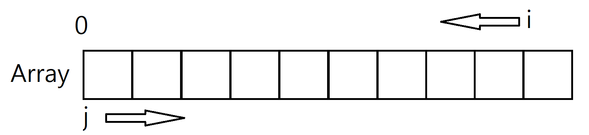

##### (본 페이지는 C언어 x86기준으로 작성하였습니다.)

# 거품 정렬(BubbleSort)

정렬되는 원소의 이동이 마치 수면 위로 올라오는 거품과 같은 모습같다 하여 붙여진

거품 정렬은 데이터의 인접한 두 원소를 비교하여, 정렬되어 있다면 통과, 그렇지 않다면 두 원소를 교환하는 방식으로 진행한다.


# main함수

```c
int main()
{
	int array[10] = {4,32,3,5,2,14,53,1,23,20};

	
	printf("before sort : ");
	for (int i = 0; i < 10;i++) {//
		printf("%3d",array[i]);
	}
	printf("\n\n");

	bubbleSort(array,10);

	printf("after sort : ");
	for (int i = 0; i < 10; i++) {
		printf("%3d", array[i]);
	}
	printf("\n\n");


	return 0;
}
```

int형 배열 10자리에 10개의 숫자를 무작위로 선언하였다.

main함수에서는

> 1.정렬 전 배열을 출력
>
> 2.정렬
>
> 3.정렬 된 배열 출력  순서로 진행한다.

(정렬 알고리즘을 포스팅하면서 main함수는 바뀌지 않고 정렬 방법만 바뀔 예정입니다.)


# bubbleSort함수

```c
void bubbleSort(int * array,int lengthOfArray) {
	
	int temp;

	for (int i = lengthOfArray - 1; i > 0; i--) {

		for (int j = 0; j < i;j++) {//Send the max value to the end of the array
			if (array[j]>array[j+1]) {
				temp = array[j];
				array[j] = array[j+1];
				array[j+1] = temp;
			}
		}
	}
}
```

bubblesort()함수는 int형 포인터와 배열의 크기를 파라미터로 전달 받는다.

(나중에 포스팅 할 다른 정렬들도 대부분 배열의 포인터와 크기를 파라미터로 전달할 것이다.)



위 그림은 거품정렬을 진행할 인수 i와 j의 진행방향을 그림화 한것이다.


1. j는 배열의 0번째 원소부터 i번째 원소까지 진행해가면서 인접한 두 원소가 정렬되어있다면 통과,그렇지 않다면 교환할 것이다.


2. i는 j가 i번째까지 정렬을 완료하면 한 칸씩 왼쪽으로 진행 할 것이며, i가 1이 될 때까지 1번의 과정을 반복한다.


 # 특징

### 장점

- 코드가 단순하고 구현이 쉽다.

### 단점

- 정렬 시간동안 인접한 두 원소에 매 번 접근하여 정렬조건을

  비교하므로 데이터가 늘어날수록 시간이 급격하게 늘어난다.


# 시간복잡도

.PNG)


# References

- 위키백과 - 버블정렬
- Do it! 자료구조와 함께 배우는 알고리즘 입문(한빛미디어)
- https://gmlwjd9405.github.io/2018/05/06/algorithm-bubble-sort.html